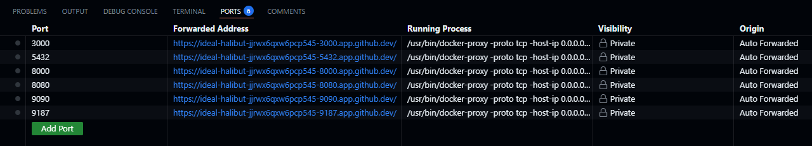

Documentación para Levantar el Proyecto en GitHub Codespaces.

Este proyecto utiliza Docker Compose para gestionar múltiples servicios, incluyendo una aplicación FastAPI, una base de datos PostgreSQL, pgAdmin, Prometheus, y Grafana. 

Servicios alojados en Docker Compose.
    El archivo docker-compose.yml define los siguientes servicios:

    -PostgreSQL: Base de datos para la aplicación.
    -FastAPI: Backend de la aplicación.
    -pgAdmin: Interfaz gráfica para administrar PostgreSQL.
    -Prometheus: Sistema de monitoreo y alertas.
    -Grafana: Herramienta de visualización de métricas.

# A continuacion se detallan los pasos para levantar el proyecto.

## 1. Forkear el repositorio
Debes hacer click en Fork en la parte derecha del nombre del repositorio.

## 2. Levantar los Servicios
Ejecuta el siguiente comando para levantar todos los servicios:
    
  ```console
    docker-compose up --build
  ```

   Esto construirá las imágenes y levantará los contenedores.

## 3. Acceder a los Servicios
Ingresa a las URL generadas por Codespaces en la seccion de "PORTS".

    Puerto 3000 Grafana
    Puerto 8000 FastApi
    Puerto 8080 pgAdmin
    Puerto 9090 Prometheus



## 4. Configurar Grafana

Inicia sesión en Grafana con las credenciales predeterminadas:

    Usuario: admin
    Contraseña: admin

Configura el origen de datos de PostgreSQL en Grafana:

Ve a Configuration > Data Sources.
Selecciona PostgreSQL.
Configura la conexión con los siguientes detalles:

    Host: db:5432
    Database: red_social
    User: user
    Password: password
    Importa un dashboard o crea uno nuevo para visualizar las métricas.

## 5. Detener los Servicios
Para detener los servicios, ejecuta:
 ```console
    docker-compose down
 ```